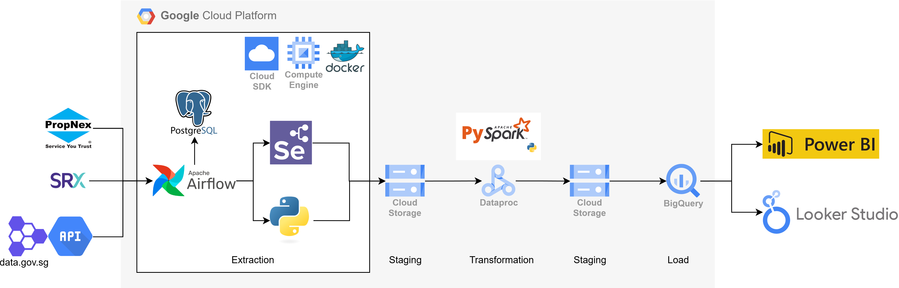
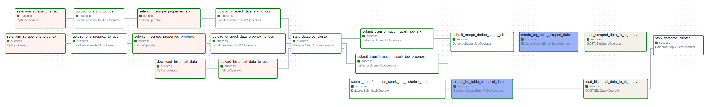

# HDB-Resale-Price-Data-Pipeline

This repository contains an ETL pipeline designed to extract, transform, and load (ETL) HDB resale price data from various property listing websites, as well as retrieve historical resale price data from an API. The data is transformed and stored in Google BigQuery, with further analysis and visualization done via Looker Studio or Power BI.

## Overview
The project automates the collection of property listings from multiple sources using Selenium and Python. Data transformation is handled using PySpark on a Google Cloud Dataproc cluster. All intermediate and final datasets are stored in Google Cloud Storage (GCS), while the final transformed data is loaded into BigQuery tables for further analysis. The pipeline is orchestrated with Apache Airflow, deployed via Docker Compose, and runs on a Google Cloud Virtual Machine (VM).

## Architecture


1. **Data Extraction**: Selenium is used to scrape URLs and property listings from Propnex and SRX.
2. **Data Ingestion**: The scraped data is uploaded to Google Cloud Storage (GCS) for staging.
3. **Historical Data Retrieval**: Historical resale price data is retrieved from an API and uploaded to GCS.
4. **Data Transformation**: PySpark jobs running on a Dataproc cluster transform both scraped and historical data.
5. **Data Deduplication**: Listings from multiple sources are merged and duplicates are removed.
6. **Data Storage**: The cleaned and transformed data is loaded into Google BigQuery for analysis.
7. **Visualization**: Data is visualized using Looker Studio or Power BI for insights and reporting.

## Pipeline DAG:
The pipeline is orchestrated using Airflow. Below is a visual representation of the Airflow DAG that outlines the ETL flow:




## Requirements

- Google Cloud Platform (GCP): The pipeline runs on GCP services, including Dataproc, GCS, BigQuery and Compute Engine.
- Docker Compose: To set up Airflow and Selenium on a GCP VM using Docker Compose.
- Apache Airflow: To orchestrate the entire ETL pipeline.
- Selenium: For web scraping property listings.


## Setup and Installation
1. **Create a GCP project and configure necessary services:**
- Enable the following APIs: BigQuery, Dataproc, GCS, Compute Engine.
- Set up Google Cloud Storage buckets for intermediate and final data.
- Create a Dataproc cluster for running PySpark jobs.
- Create an instance to run the pipeline. Ensure necessary permissions are given to the VM.

2. **Clone the repository:**
    ```
    git clone https://github.com/cyusong/HDB-Resale-Price-Data-Pipeline.git
    cd HDB-Resale-Price-Pipeline
    ```

3. **Configure Docker Compose:**

- Modify the docker-compose.yaml to match your needs. (Eg. username and password)
- Build the Docker containers:
    ```
    docker-compose up -d --build
    ```

4. **Run the Airflow DAG:**
- Once all the container is up and running, access the Airflow web interface at http://localhost:8080. (Forward port 8080 if running this pipeline in GCP Compute Engine)
- Trigger the DAG named 'hdb_resale_price_data_pipeline' to run the pipeline.

## Future Improvement
1. Automating the pipeline to run on a schedule (e.g., daily or weekly).
2. Adding more data sources for property listings.

## Visualization
Simple visualization of the data was performed using Looker Studio and Power BI. The reports can be found here:
1. [Looker Studio Report](./assets/lookerstudioreport.pdf)
2. [Power BI Report](./assets//powerbireport.pdf)


### Tech stack


